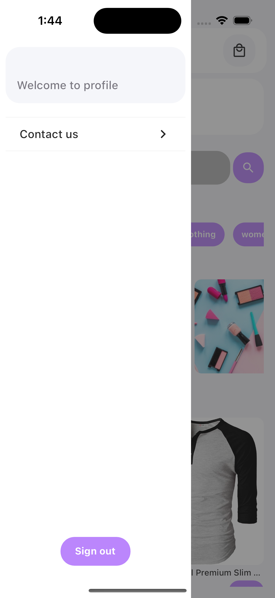

# Phase Two - E-commerce App

Phase Two is an e-commerce application built using Flutter. It provides a comprehensive shopping experience, including product browsing, search functionality, and user authentication.

## Table of Contents

- [Features](#features)
- [Installation](#installation)
- [Usage](#usage)
- [Project Structure](#project-structure)
- [Providers](#providers)
- [Contributing](#contributing)
- [License](#license)

## Features

- User Authentication (Login and Sign Up)
- Browse products by category
- Product search functionality
- Add products to the cart
- View product details
- Contact Us page

## Installation

1. **Clone the repository:**

```sh
git clone https://github.com/yourusername/phase-two.git
cd phase-two
```

2. **Install dependencies:**

```sh
flutter pub get
```

3. **Run the application:**

```sh
flutter run
```

## Usage

### Login

To log in, you have two options:
1. **Mock User Credentials**: Use the following credentials for testing:
   - Username: `test`
   - Password: `test`
   This allows you to log in with a pre-defined mock user account.

2. **Sign Up First**: If you haven't signed up yet, you'll need to create a new account by navigating to the **Sign Up** page. After signing up, you can use the credentials you registered with to log in.

### Example

1. **Log In with Mock User Credentials**:
   - Open the app and navigate to the **Login** page.
   - Enter `test` as the username and `test` as the password.
   - Tap on the **Login** button.
   - You will be redirected to the **Home** page upon successful login.

2. **Sign Up and Then Log In**:
   - If you don't have an account yet, navigate to the **Sign Up** page.
   - Fill in the required details (name, last name, email, username, and password).
   - Tap on the **Register** button to create your account.
   - After signing up, navigate back to the **Login** page.
   - Enter your registered username and password.
   - Tap on the **Login** button.
   - You will be redirected to the **Home** page upon successful login.

Please note:
- If you refresh or restart the app, any registered user information will be lost unless you sign up again.
- Mock user credentials (`test/test`) are provided solely for testing purposes and may not reflect actual user data.

## Project Structure
The project follows a structured approach for better maintainability:
```sh
  lib/
  |-- components/
  |   |-- pages/
  |       |-- cart_page.dart
  |       |-- category_page.dart
  |       |-- contact_us_page.dart
  |       |-- home_page.dart
  |       |-- login_page.dart
  |       |-- product_page.dart
  |       |-- search_page.dart
  |       |-- sign_up_page.dart
  |-- models/
  |   |-- cart_product_model.dart
  |   |-- category_model.dart
  |   |-- product_model.dart
  |   |-- user_model.dart
  |-- providers/
  |   |-- auth_provider.dart
  |   |-- cart_provider.dart
  |   |-- category_provider.dart
  |   |-- lateral_menu_provider.dart
  |   |-- product_provider.dart
  |-- tokens/
  |   |-- app_colors.dart
  |   |-- app_spacing.dart
  |   |-- app_text_styles.dart
  |-- utils/
  |   |-- alerts_utils.dart
  |   |-- string_utils.dart
  |-- routes.dart
  |-- main.dart
```

## Providers

The app uses the Provider package for state management. Below are the providers used:

- AuthProvider: Manages user authentication and form validation.
- CartProvider: Manages the products added to the cart and their quantities.
- CategoryProvider: Fetches and provides product categories.
- LateralMenuProvider: Controls the lateral menu animations.
- ProductProvider: Manages product data, including search functionality and filtering by category.

## Screenshots





## Contributing

Contributions are welcome! Please fork the repository and submit a pull request for any changes you would like to make.

## License

This project is licensed under the MIT License. See the LICENSE file for more information.

